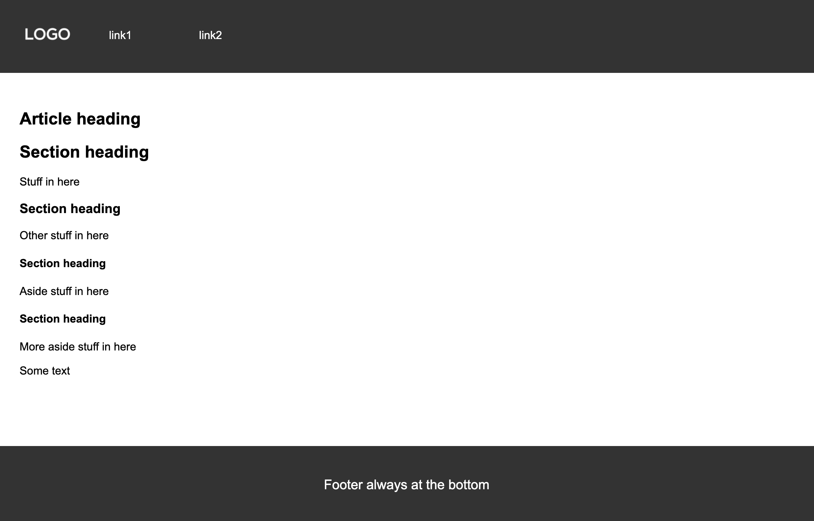

<h1 align="center">Footer always at the Bottom</h1>

[View the live project here.](https://renato79.github.io/Footer-always-at-the-bottom/)

I wrote this very simple example of Semantic Structure in HTML5 and CSS3 to help developers at their first experience to have a basic structured page, and solve the problem with a Footer that doesn't stay at the bottom of the page. How many times you read help requests where users can't make the Footer stay at the bottom of their webpage when the page is short and the screen is not filled? Here is the solution. I hope this will help.

<p align="center">
  
</p>

## How to Fork and Clone
### Forking the GitHub Repository

By forking the GitHub Repository we make a copy of the original repository on our GitHub account to view and/or make changes without affecting the original repository by using the following steps...

1. Log in to GitHub and locate the [GitHub Repository](https://github.com/Renato79/Footer-always-at-the-bottom)
2. At the top of the Repository (not top of page) just above the "Settings" Button on the menu, locate the "Fork" Button.
3. You should now have a copy of the original repository in your GitHub account.

### Making a Local Clone

1. Log in to GitHub and locate the [GitHub Repository](https://github.com/Renato79/Footer-always-at-the-bottom)
2. Under the repository name, click "Clone or download".
3. To clone the repository using HTTPS, under "Clone with HTTPS", copy the link.
4. Open Git Bash
5. Change the current working directory to the location where you want the cloned directory to be made.
6. Type `git clone`, and then paste the URL you copied in Step 3.

```
$ git clone https://github.com/Renato79/Footer-always-at-the-bottom/
```

7. Press Enter. Your local clone will be created.

```
$ git clone https://github.com/Renato79/Footer-always-at-the-bottom/
> Cloning into `CI-Clone`...
> remote: Counting objects: 10, done.
> remote: Compressing objects: 100% (8/8), done.
> remove: Total 10 (delta 1), reused 10 (delta 1)
> Unpacking objects: 100% (10/10), done.
```

Click [Here](https://help.github.com/en/github/creating-cloning-and-archiving-repositories/cloning-a-repository#cloning-a-repository-to-github-desktop) to retrieve pictures for some of the buttons and more detailed explanations of the above process.